# 🚴‍♂️ IoT Bike Tracker

<div align="center">


**An advanced, solar-powered GPS bike tracker with real-time location monitoring and GSM communication capabilities**

[🚀 Quick Start](#-quick-start) • [📋 Features](#-features) • [🔧 Hardware](#-hardware-requirements) • [📖 Documentation](#-api-documentation) • [🤝 Contributing](#-contributing)

</div>

---

## 📋 Table of Contents

- [Overview](#-overview)
- [Features](#-features)
- [Hardware Requirements](#-hardware-requirements)
- [Software Requirements](#-software-requirements)
- [Quick Start](#-quick-start)
- [Hardware Assembly](#-hardware-assembly)
- [Pin Configuration](#-pin-configuration)
- [Software Installation](#️-software-installation)
- [API Documentation](#-api-documentation)
- [SIM800L Internet Setup Guide](#-sim800l-internet-setup-guide)
- [Web API Integration Guide](#-web-api-integration-guide)
- [Usage Examples](#-usage-examples)
- [Troubleshooting](#-troubleshooting)
- [Changelog](#-changelog)
- [Contributing](#-contributing)
- [License](#-license)
- [Acknowledgments](#-acknowledgments)

---

## Overview

The **IoT Bike Tracker** is a comprehensive solution for bicycle security and monitoring, featuring real-time GPS tracking, GSM communication, and sustainable solar power. Built with the ESP8266-based NodeMCU v3.1.0, this project combines robust hardware design with efficient software architecture for reliable outdoor operation.

### Key Highlights

-  **Real-time GPS Tracking** with Neo6m module (fully implemented)
-  **GSM Communication** via SIM800L for remote monitoring (fully implemented) 
-  **HTTP API Integration** with web services over GPRS (fully implemented)
-  **Solar-powered** with dual 18650 battery backup (hardware design)
-  **Modular Code Architecture** for easy customization (fully implemented)
-  **Weather-resistant** 3D-printed enclosure (design provided)
-  **Secure Bike Mounting** with custom clamp design (design provided)

### **Implementation Status**

#### **Core Features (Ready to Use)**
- GPS tracking with NMEA parsing
- SMS notifications and HTTP API
- Motion detection (GPS-based)
- Speed monitoring and alerts  
- Geofencing with breach detection
- System status monitoring
- Dual mode operation (Testing/Production)
- Network connectivity management
- **Comprehensive power sleep modes**
- **Low power management system**

####  **Optional Hardware Enhancements**
- LED status indication (requires LED on D8)
- Audio alerts (requires buzzer on D7)

####  **Future Enhancements**
- OTA updates
- Mobile app integration

---

##  Features

###  **GPS Tracking System**
- High-precision location tracking with Neo6m GPS module
- Real-time coordinate acquisition and processing
- Configurable update intervals for battery optimization
- NMEA data parsing and validation

###  **GSM Communication**
- SMS-based location reporting via SIM800L module
- **HTTP POST requests** to web APIs over GPRS
- Real-time data transmission to cloud services
- Remote command processing capability
- Network status monitoring and error handling
- Configurable message intervals (default: 30 minutes)

###  **Power Management**
- Dual solar panel charging system
- 2S BMS protection for 18650 lithium batteries
- Buck converter voltage regulation
- **Comprehensive sleep mode implementation**
- **Low power mode with activity monitoring**
- **Deep sleep for extended battery life**
- Configurable update intervals for power optimization

###  **Hardware Design**
- Robust PCB layout optimized for outdoor use
- Water-resistant (IP54) 3D-printed enclosure
- Secure bike mounting system with anti-theft features
- Temperature-resistant component selection


###  Bike Tracker Case Models (Stackable Modular Parts)

All enclosure parts are in the `model/` folder. The cases are designed as stackable modular parts—each piece fits together to form the complete enclosure. You can use just the original case, or stack Case 2 parts on top for a multi-layer build. Below are previews and download links for all parts:

<div align="center">
    <table>
        <tr>
            <td align="center" colspan="2">
                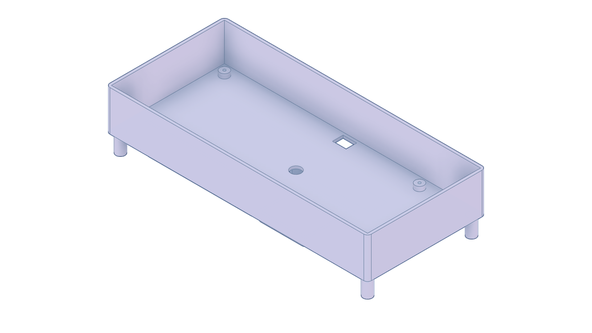
                <br />
                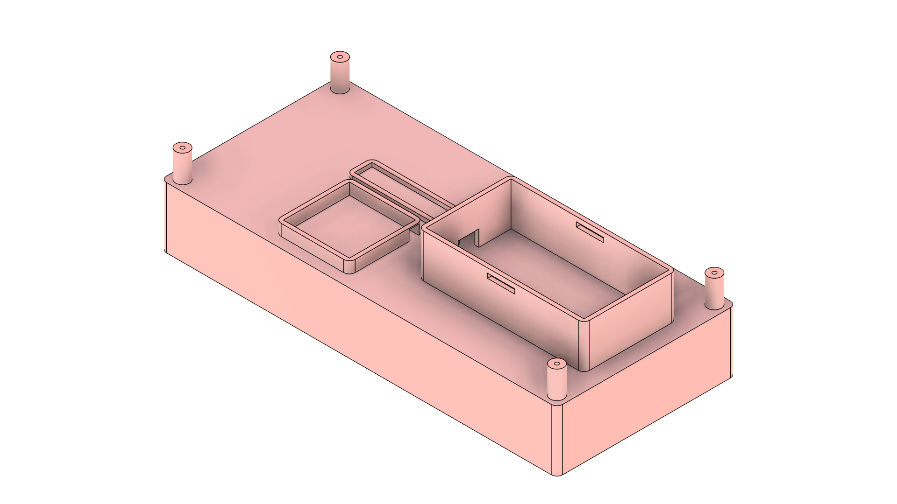
                <br />
                <strong>Case 1 — Top & Bottom Views</strong>
                <br />
                <a href="model/Bike_Tracker_Case_Top.png">Top View PNG</a> · <a href="model/Bike_Tracker_Case_Bottom.png">Bottom View PNG</a> · <a href="model/Bike_Tracker_Case.stl">STL</a> · <a href="model/CE3V3SE_Bike_Tracker_Case.gcode">GCODE</a>
            </td>
            <td align="center" colspan="2">
                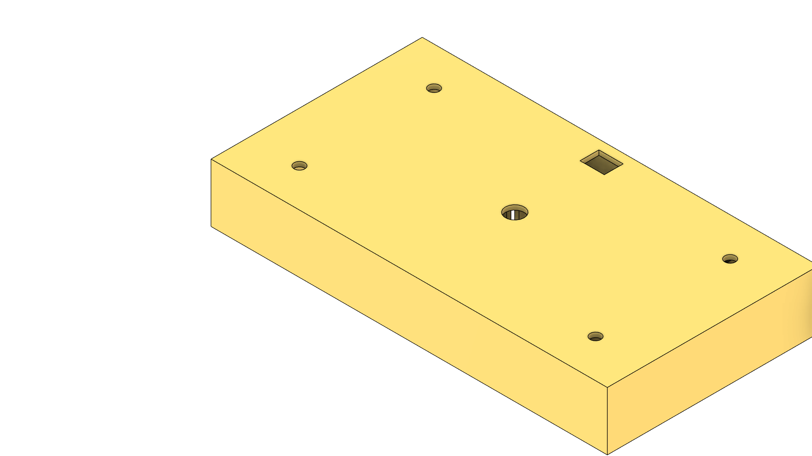
                <br />
                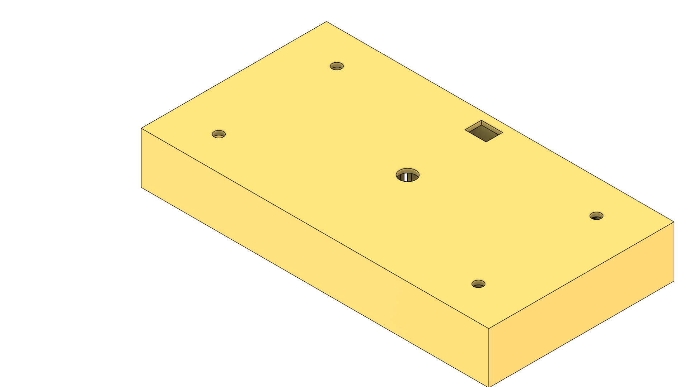
                <br />
                <strong>Case 2 — Top & Bottom Views</strong>
                <br />
                <a href="model/Bike_Tracker_Case_2_Top.png">Top View PNG</a> · <a href="model/Bike_Tracker_Case_2_Bottom.png">Bottom View PNG</a> · <a href="model/Bike_Tracker_Case_2.stl">STL</a> · <a href="model/CE3V3SE_Bike_Tracker_Case_2.gcode">GCODE</a>
            </td>
            <td align="center" colspan="2">
                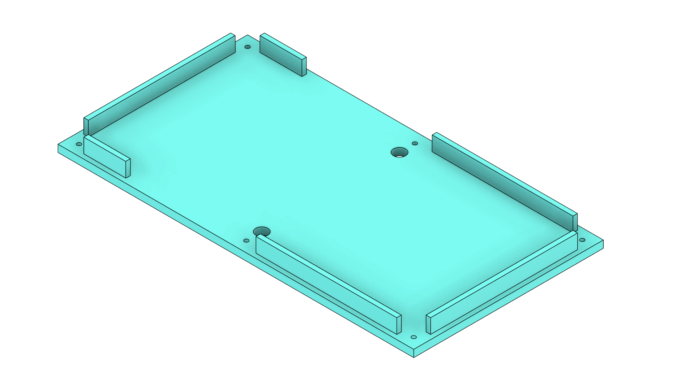
                <br />
                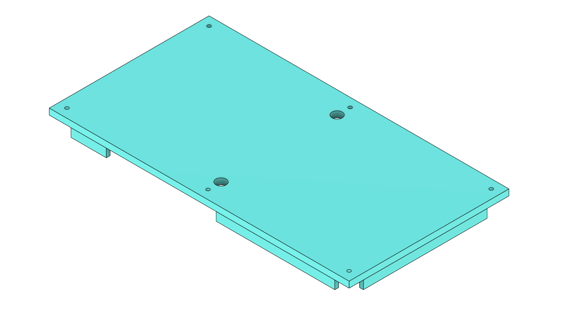
                <br />
                <strong>Case 2 Cover — Top & Bottom Views</strong>
                <br />
                <a href="model/Bike_Tracker_Case_2_Cover_Top.png">Top View PNG</a> · <a href="model/Bike_Tracker_Case_2_Cover_Bottom.png">Bottom View PNG</a> · <a href="model/Bike_Tracker_Case_2_Cover.stl">STL</a> · <a href="model/CE3V3SE_Bike_Tracker_Case_2_Cover.gcode">GCODE</a>
            </td>
                <td align="center" colspan="2">
                    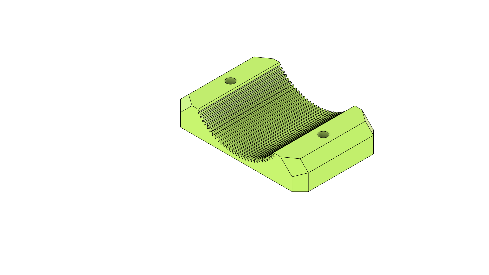
                    <br />
                    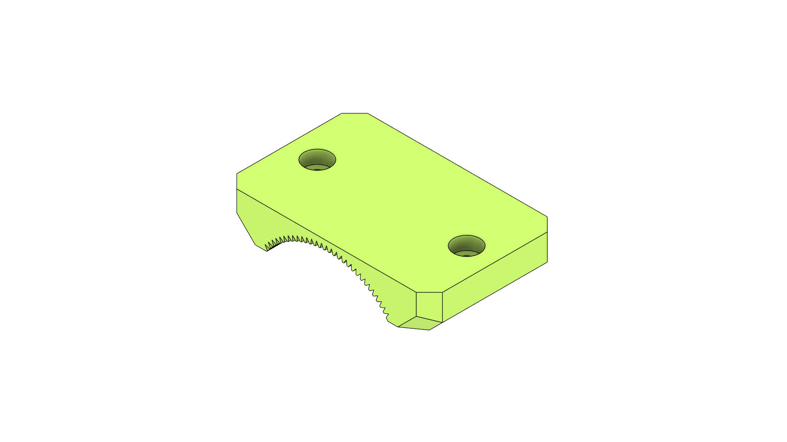
                    <br />
                    <strong>Clamp Case 2 Cover Support — Top & Bottom Views</strong>
                    <br />
                    <a href="model/Bike_Tracker_Clamp_Case_2_Cover_Support_Top_View.png">Top View PNG</a> · <a href="model/Bike_Tracker_Clamp_Case_2_Cover_Support_Bottom_View.png">Bottom View PNG</a> · <a href="model/Bike_Tracker_Clamp_Case_2_Cover_Support.stl">STL</a> · <a href="model/CE3V3SE_Bike_Tracker_Clamp_Case_2_Cover_Support.gcode">GCODE</a>
                </td>
                    <td align="center" colspan="2">
                        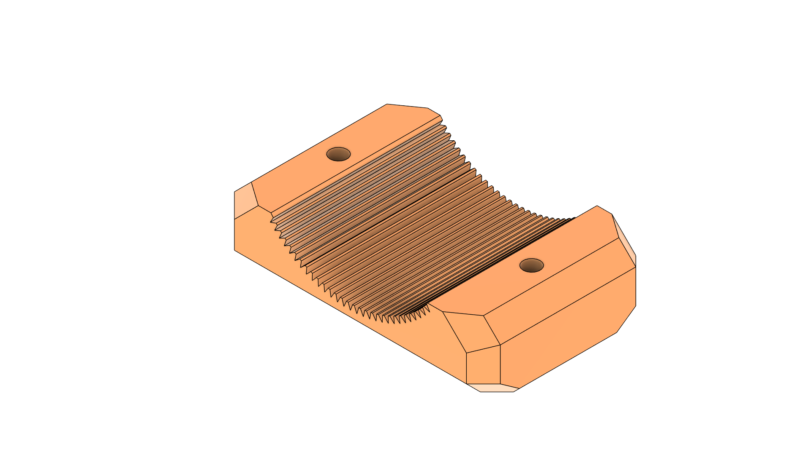
                        <br />
                        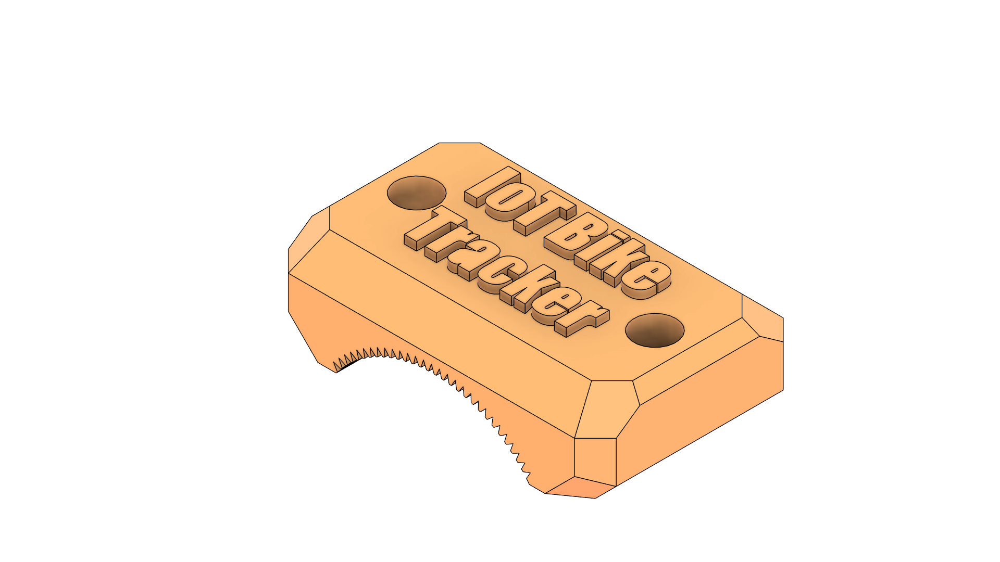
                        <br />
                        <strong>Bike Tracker Clamp — Top & Bottom Views</strong>
                        <br />
                        <a href="model/Bike_Tracker_Clamp_Top_View.png">Top View PNG</a> · <a href="model/Bike_Tracker_Clamp_Bottom_View.png">Bottom View PNG</a> · <a href="model/Bike_Tracker_Clamp.stl">STL</a> · <a href="model/CE3V3SE_Bike_Tracker_Clamp.gcode">GCODE</a>
                    </td>
                        <td align="center" colspan="2">
                            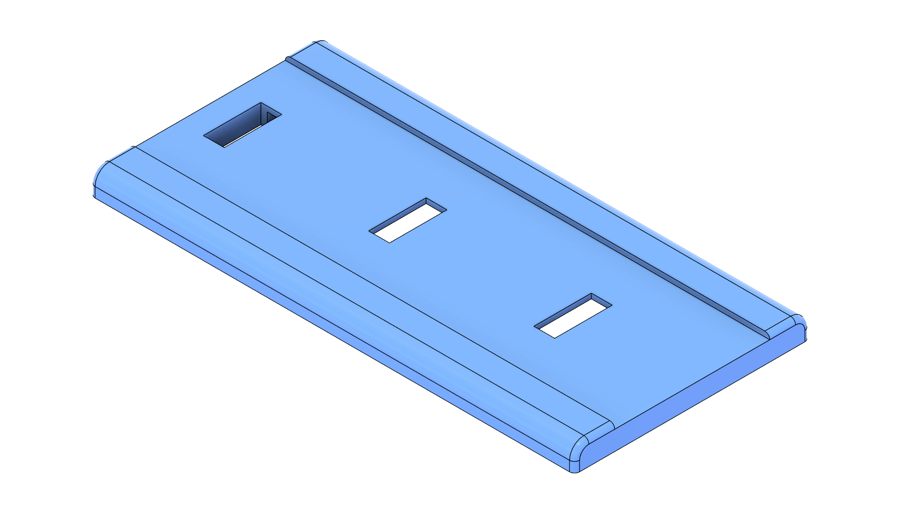
                            <br />
                            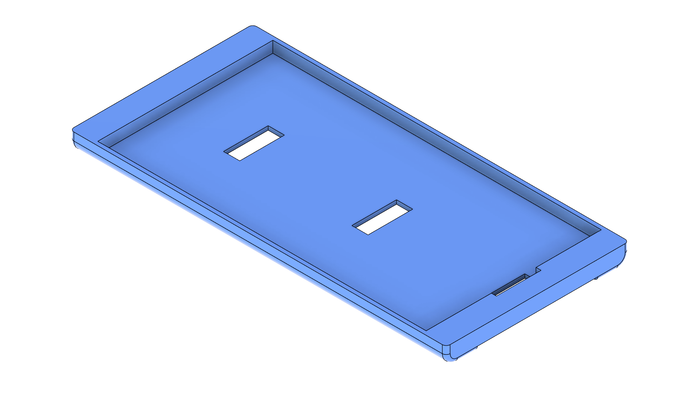
                            <br />
                            <strong>Case Cover Solar Mount — Top & Bottom Views</strong>
                            <br />
                            <a href="model/Bike_Tracker_Case_Cover_Solar_Mount_Top_View.png">Top View PNG</a> · <a href="model/Bike_Tracker_Case_Cover_Solar_Mount_Bottom_View.png">Bottom View PNG</a> · <a href="model/Bike_Tracker_Case_Cover_Solar_Mount.stl">STL</a>
                        </td>
                            <td align="center" colspan="2">
                                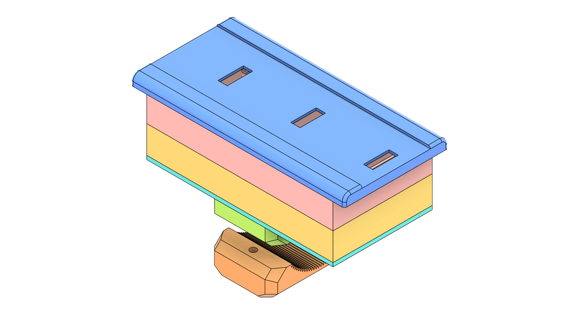
                                <br />
                                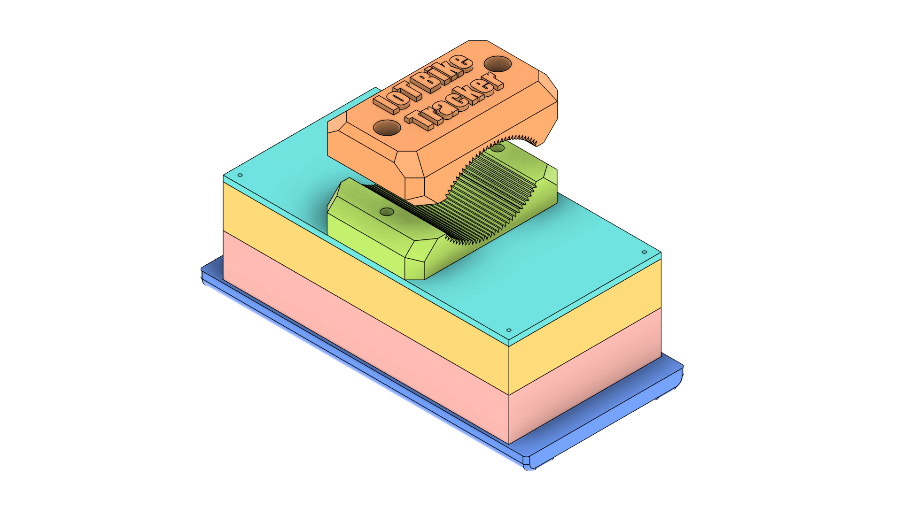
                                <br />
                                <strong>All Parts Joined — Top & Bottom Views</strong>
                                <br />
                                <a href="model/Bike_Tracker_All_Parts_Joined_Top_View.png">Top View PNG</a> · <a href="model/Bike_Tracker_All_Parts_Joined_Bottom_View.png">Bottom View PNG</a>
                            </td>
        </tr>
    </table>
</div>

> **Printing notes:** Use PETG or ABS for weather resistance. Add internal standoffs for the PCB and cable exits with grommets for water protection. All parts are designed to stack as modular layers—combine only the parts you need for your build.

#### Assembly Guide
1. Print all required parts and clean off support material.
2. Install electronics (NodeMCU, SIM800L, Neo6m, batteries) into the Case 1 bottom. Secure the PCB and components.
3. Place Case 1 top onto the bottom and loosely fasten screws. If routing wires upward, leave screws slightly loose.
4. Stack Case 2 bottom on top of Case 1 top. Align pegs and holes for a snug fit.
5. Fasten the stacked cases together using M3 screws or clips. Make sure the joint is tight and secure.
6. For weatherproofing, apply a thin bead of silicone or use a gasket between the mating faces.
7. Route antennas or cables through the upper compartment as needed. Seal any cable exits with silicone or cable glands.

#### Recommended Print Settings
- Material: PETG or ABS for outdoor durability
- Layer height: 0.2 mm
- Walls: 2–3 perimeters (≥1.2 mm)
- Infill: 20–40% depending on strength needs
- Supports: Use for overhangs and internal features

#### Quick Fit Checklist
1. Check alignment and fit of all stacked parts before final assembly.
2. Verify clearance for antennas, SIM slot, and cables.
3. Confirm screw lengths do not interfere with electronics.
4. Inspect gasket or seal for full coverage.

###  **Software Architecture**
- Object-oriented C++ design with separate classes
- Modular GPS and GSM communication libraries
- Comprehensive error handling and recovery
- Serial debugging and monitoring capabilities
- **Dual operating modes** (Testing/Development and Production)
- **State management system** (Initializing, Standby, Tracking, Alert, Error)
- **Enhanced modular architecture** with proper separation of concerns

#### **Complete File Architecture**

```
Source/BikeTracker/
├── BikeTracker.ino          # Main application logic with dual mode support
├── ModeConfig.h             # Operating mode configuration  
├── PinConfig.h              # Hardware pin definitions
├── APIConfig.h              # HTTP API configuration
├── BikeTrackerCore.h/.cpp   # Core tracking logic with HTTP integration
├── Neo6mGPS.h/.cpp         # Enhanced GPS module with full NMEA parsing
└── Sim800L.h/.cpp          # Enhanced GSM module with HTTP capabilities
```

#### **Enhanced System Features**

** Dual Mode Operation:**
- **Testing Mode**: Debug output, serial commands, accelerated timing, test SMS
- **Production Mode**: Minimal logging, normal timing, real emergency contacts

** Advanced Core Logic:**
- Motion detection algorithms with GPS-based tracking
- Speed monitoring with configurable limits
- Geofencing with breach detection
- Alert system with multiple types (Motion, Speed, Geofence, System errors)
- **Comprehensive power sleep mode implementation**
- **Low power management with activity tracking**
- Emergency SMS notifications
- **Automatic web API data transmission**
- **Real-time location updates to HTTP endpoints**

** Enhanced GPS Features:**
- Full NMEA sentence parsing (GGA and RMC)
- Real-time location data extraction
- Speed calculation and monitoring
- GPS fix status detection
- Coordinate conversion (DMS to Decimal)

** Advanced GSM Capabilities:**
- Network status monitoring and signal strength checking
- Reliable SMS transmission with error handling
- AT command processing with timeout handling
- **HTTP POST requests over GPRS**
- **GPRS initialization and management**
- **JSON data transmission**
- **Automatic reconnection with exponential backoff**
- **Connection health monitoring**

** Testing Mode Commands:**
- `ARM/DISARM` - Security control
- `STATUS` - Detailed system status
- `DIAG` - Hardware diagnostics
- `ALERT/SPEED/FENCE` - Simulate GPS-based alerts
- `LOCATE` - Send location SMS
- `API` - Test HTTP API connectivity
- `CONNECT` - Test internet connectivity
- `RESET` - Reset GPRS connection
- `SLEEP` - Enter sleep mode (5 min)
- `DEEPSLEEP` - Enter deep sleep (30 min)
- `LOWPOWER` - Toggle low power mode
- `WAKE` - Wake from sleep
- `HELP` - Command reference

**Note**: Full power management system implemented with comprehensive sleep modes.

---

##  Hardware Requirements

###  **Bill of Materials (BOM)**

| Component | Quantity | Specification | Purpose |
|-----------|----------|---------------|---------|
|  **Mini Solar Panel** | 2x | 5V 1W Polycrystalline | Primary power source |
|  **18650 Lithium Battery** | 2x | 3.7V 3000mAh Protected | Energy storage |
|  **2S BMS Module** | 1x | 7.4V 8A Protection | Battery management |
|  **Buck Converter** | 2x | DC-DC Step Down 3.3V/5V | Voltage regulation |
|  **NodeMCU v3.1.0** | 1x | ESP8266 Development Board | Main microcontroller |
|  **Neo6m GPS Module** | 1x | UART GPS Receiver | Location tracking |
|  **SIM800L GSM Module** | 1x | Quad-band GSM/GPRS | Communication |
|  **3D Printed Case** | 1x | Water-resistant ABS/PETG | Protection enclosure |
|  **Bike Mounting Clamp** | 1x | Adjustable Security Clamp | Secure attachment |

###  **Power Specifications**
- **Input Voltage**: 5V (Solar) / 7.4V (Battery)
- **Operating Voltage**: 3.3V (MCU) / 5V (Modules)
- **Power Consumption**: ~200mA (Active) / ~50μA (Sleep)
- **Battery Life**: 7-14 days (weather dependent)

###  **Feature Compatibility**

####  **Basic Hardware (GPS + GSM + MCU)**
-  Real-time GPS tracking
-  SMS notifications and HTTP API
-  Motion detection (GPS-based)
-  Speed monitoring and alerts
-  Geofencing with breach detection
-  System status monitoring
-  Comprehensive power sleep modes

####  **Optional Hardware Enhancements**
-  **Audio Alerts** - Buzzer pin defined and function implemented (D7)
-  **Status LEDs** - LED pin defined and function implemented (D8)

**Note**: The current implementation focuses on GPS+GSM functionality with comprehensive power management. LED and buzzer functionality is implemented but requires physical components.

---

##  Software Requirements

###  **Development Environment**
- **Arduino IDE** 1.8.19 or later
- **ESP8266 Board Package** 3.0.0 or later
- **USB to Serial Driver** (CP2102/CH340)

###  **Required Libraries**

```cpp
// Core Libraries (Built-in)
#include <Arduino.h>
#include <SoftwareSerial.h>

// Project-specific Libraries (Included)
#include "Neo6mGPS.h"     // GPS module handler
#include "Sim800L.h"      // GSM module handler
```

###  **Library Installation**
```bash
# Install ESP8266 Board Package
# File → Preferences → Additional Board Manager URLs:
# http://arduino.esp8266.com/stable/package_esp8266com_index.json
```

---

##  Quick Start

###  **Clone Repository**
```bash
git clone https://github.com/qppd/IoT-Bike-Tracker.git
cd IoT-Bike-Tracker/Source/BikeTracker
```

###  **Hardware Setup**
- Assemble components according to wiring diagram
- Connect solar panels and battery system
- Mount GPS and GSM antennas appropriately

###  **Software Upload**
- Open `BikeTracker.ino` in Arduino IDE
- Select **NodeMCU 1.0 (ESP-12E Module)** board
- Choose appropriate COM port
- Upload code to device

###  **Initial Configuration**
- Insert activated SIM card into SIM800L module
- Power on the system and monitor serial output
- Test GPS acquisition and GSM connectivity

---

##  Hardware Assembly

###  **Power System Connection**

```
Solar Panels → Buck Converter → 2S BMS → 18650 Batteries
     ↓              ↓             ↓           ↓
   5V Input    →  Regulated   →  7.4V    →  Power
                   Voltage      Storage     Backup
```

###  Wiring Diagram

The wiring diagram below shows the recommended connections between the NodeMCU (ESP8266), Neo6m GPS, SIM800L, power system (buck converters and 2S BMS) and optional buzzer / status LED. Use the diagram as a reference when assembling the hardware; verify voltage levels before connecting modules.

<div align="center">
    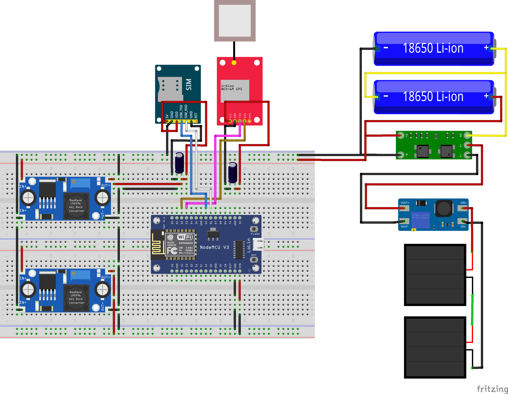
</div>

> Note: The SIM800L requires a stable 4V-ish supply capable of delivering peak currents (~2A). Use a proper buck regulator and large decoupling capacitors near the module.

### 📡 **Module Integration**

1. **GPS Module (Neo6m)**
   - Connect VCC to 3.3V regulated output
   - Connect GND to common ground
   - Wire RX/TX to designated GPIO pins

2. **GSM Module (SIM800L)**
   - Connect VCC to 5V regulated output (high current)
   - Ensure stable power supply with capacitors
   - Connect antenna for optimal signal reception

3. **NodeMCU Integration**
   - Power via VIN pin (5V) or 3.3V pin
   - Configure GPIO pins for SoftwareSerial communication
   - Implement proper grounding across all modules

---

##  Pin Configuration

###  **NodeMCU v3.1.0 Pin Mapping**

| Module | Function | NodeMCU Pin | GPIO | Notes |
|--------|----------|-------------|------|-------|
| **GPS** | RX | D2 | GPIO4 | SoftwareSerial RX |
| **GPS** | TX | D3 | GPIO0 | SoftwareSerial TX |
| **GSM** | RX | D5 | GPIO14 | SoftwareSerial RX |
| **GSM** | TX | D6 | GPIO12 | SoftwareSerial TX |
| **Buzzer** | Signal | D7 | GPIO13 | Audio alerts (implemented) |
| **Status LED** | Signal | D8 | GPIO15 | Status indication (implemented) |
| **Power** | VIN | VIN | - | 5V Input |
| **Debug** | USB | USB | - | Serial Monitor |

###  **Important Notes**
- Avoid using GPIO0, GPIO2, GPIO15 during boot
- Ensure proper pull-up/pull-down resistors where needed
- Use level shifters if voltage mismatch occurs

---

##  Software Installation

###  **Step-by-Step Installation**

1. **Prepare Development Environment**
   ```bash
   # Install Arduino IDE
   # Add ESP8266 board support
   # Install required drivers
   ```

2. **Configure Board Settings**
   ```
   Board: "NodeMCU 1.0 (ESP-12E Module)"
   CPU Frequency: "80 MHz"
   Flash Size: "4MB (FS:2MB OTA:~1019KB)"
   Upload Speed: "115200"
   ```

3. **Compile and Upload**
   ```cpp
   // Verify code compilation
   // Select correct COM port
   // Upload to device
   // Monitor serial output
   ```

###  **Configuration Options**

The system uses modular configuration files for easy customization:

#### **Mode Configuration (ModeConfig.h)**
```cpp
// Set operating mode
#define CURRENT_MODE MODE_TESTING    // or MODE_PRODUCTION

// Mode-specific settings
#if CURRENT_MODE == MODE_TESTING
    #define GPS_UPDATE_INTERVAL 5000      // 5 seconds for testing
    #define SMS_ALERT_INTERVAL 30000      // 30 seconds for testing
    #define MOTION_THRESHOLD 5            // Lower threshold for testing
    #define MAX_SPEED_THRESHOLD 10        // km/h for testing alerts
    #define EMERGENCY_CONTACT "+1234567890"  // Test number
#endif
```

#### **API Configuration (APIConfig.h)**
```cpp
// Web API settings
#define WEB_API_URL "https://your-api.com/api/tracker"
#define DEVICE_ID "BIKE_TRACKER_001"
#define APN_NAME "internet"

// Update intervals
#define HTTP_UPDATE_INTERVAL 30000       // 30 seconds
#define HTTP_RETRY_ATTEMPTS 3
#define CONNECTION_CHECK_INTERVAL 60000  // 1 minute
```

#### **Pin Configuration (PinConfig.h)**
```cpp
// Hardware pin assignments
#define GPS_RX_PIN D2
#define GPS_TX_PIN D3
#define GSM_RX_PIN D5
#define GSM_TX_PIN D6
#define BUZZER_PIN D7
#define LED_STATUS_PIN D8
```

---

##  API Documentation

###  **Neo6mGPS Class**

#### **Constructor**
```cpp
Neo6mGPS(SoftwareSerial &serial)
```
Initializes GPS module with specified serial interface.

#### **Methods**

| Method | Return Type | Description |
|--------|-------------|-------------|
| `begin(long baudrate)` | `void` | Initialize GPS serial communication |
| `available()` | `bool` | Check if GPS data is available |
| `read()` | `String` | Read GPS NMEA sentence |

#### **Enhanced Features**
- Full NMEA sentence parsing (GGA and RMC)
- Real-time location data extraction
- Speed calculation and monitoring
- GPS fix status detection
- Coordinate conversion (DMS to Decimal)

#### **Usage Example**
```cpp
SoftwareSerial SerialGPS(D2, D3);
Neo6mGPS gps(SerialGPS);

void setup() {
    gps.begin(9600);
}

void loop() {
    if (gps.available()) {
        String gpsData = gps.read();
        // Process GPS data
    }
}
```

###  **Sim800L Class**

#### **Constructor**
```cpp
Sim800L(SoftwareSerial &serial)
```
Initializes GSM module with specified serial interface.

#### **Methods**

| Method | Return Type | Description |
|--------|-------------|-------------|
| `begin(long baudrate)` | `void` | Initialize GSM serial communication |
| `sendSMS(String number, String message)` | `void` | Send SMS to specified number |
| `available()` | `bool` | Check if GSM data is available |
| `read()` | `String` | Read GSM response data |
| `initializeGPRS(String apn, String user, String pass)` | `bool` | Initialize GPRS connection |
| `sendHTTPPOST(String url, String jsonData, String &response)` | `bool` | Send HTTP POST request |
| `sendLocationHTTP(String url, String deviceId, float lat, float lon, String alertType)` | `bool` | Send location data to web API |
| `disconnectGPRS()` | `void` | Disconnect GPRS connection |
| `setHTTPHeaders(String headers)` | `void` | Set custom HTTP headers |

#### **Enhanced Features**
- Network status monitoring
- Signal strength checking
- Reliable SMS transmission
- AT command processing
- **HTTP POST requests**
- **GPRS initialization and management**
- **JSON data transmission**
- Error handling and recovery
- Automatic reconnection with exponential backoff
- Connection health monitoring

#### **Usage Example**
```cpp
SoftwareSerial SerialGSM(D5, D6);
Sim800L gsm(SerialGSM);

void setup() {
    gsm.begin(9600);
}

void sendLocation() {
    gsm.sendSMS("+1234567890", "Bike Location: lat,lng");
}
```

###  **HTTP API Integration**

The bike tracker now supports sending location data to web APIs via HTTP POST requests over GPRS with comprehensive internet connectivity features.

#### **Configuration**

Edit `APIConfig.h` to configure your web API:

```cpp
// Your web API endpoint
#define WEB_API_URL "https://your-api.com/api/tracker"

// Unique device identifier
#define DEVICE_ID "BIKE_TRACKER_001"

// Mobile carrier APN - Common APNs
#define APN_NAME "internet"           // Generic (try this first)

// === US CARRIERS ===
// #define APN_NAME "vzwinternet"     // Verizon
// #define APN_NAME "phone"           // AT&T
// #define APN_NAME "fast.t-mobile.com" // T-Mobile

// === EUROPEAN CARRIERS ===
// #define APN_NAME "three.co.uk"     // Three UK
// #define APN_NAME "orangeworld"     // Orange

// Update interval (milliseconds)
#define HTTP_UPDATE_INTERVAL 30000  // 30 seconds

// Connection settings
#define GPRS_RETRY_ATTEMPTS 3        // Connection retry attempts
#define HTTP_RETRY_ATTEMPTS 3        // HTTP request retries
#define CONNECTION_CHECK_INTERVAL 60000 // 1 minute

// Enable/disable HTTP functionality
#define HTTP_ENABLED true
```

#### **JSON Data Format**

The tracker sends location data in the following JSON format:

```json
{
    "deviceId": "BIKE_TRACKER_001",
    "latitude": 40.7128,
    "longitude": -74.0060,
    "timestamp": "1640995200000",
    "alertType": "MOTION_DETECTED",
    "signalStrength": 25,
    "localIP": "10.64.64.64",
    "imei": "123456789012345"
}
```

#### **Alert Types**

The `alertType` field can contain the following values:

- `""` (empty) - Regular location update
- `"MOTION_DETECTED"` - Unauthorized movement detected (GPS-based) ✅
- `"SPEED_EXCEEDED"` - Speed limit exceeded (GPS-based) ✅
- `"GEOFENCE_BREACH"` - Vehicle left safe area (GPS-based) ✅
- `"SYSTEM_ERROR"` - System malfunction ✅
- `"GPS_LOST"` - GPS signal lost for extended period ✅
- `"GSM_LOST"` - GSM connection lost for extended period ✅

**Note**: Clean alert system focused on GPS+GSM functionality without hardware dependencies.

#### **API Endpoint Requirements**

Your web API should accept POST requests with:
- **Content-Type**: `application/json`
- **HTTP Method**: `POST`
- **Expected Response**: HTTP 200-299 for success

Example response format:
```json
{
    "status": "success",
    "message": "Location data received",
    "deviceId": "BIKE_TRACKER_001"
}
```

#### **Usage Example**

```cpp
// Configure the web API in setup()
void setup() {
    tracker.setWebAPI(WEB_API_URL, DEVICE_ID, APN_NAME);
}

// Location data is automatically sent every HTTP_UPDATE_INTERVAL
// Manual sending can be triggered with:
tracker.sendLocationToAPI();
```

#### **Testing Commands**

In testing mode, use these serial commands:
- `ARM` - Arm the tracker
- `DISARM` - Disarm the tracker
- `STATUS` - View detailed system status
- `DIAG` - Run hardware diagnostics
- `ALERT` - Simulate motion alert
- `SPEED` - Simulate speed alert
- `FENCE` - Simulate geofence breach
- `LOCATE` - Send location SMS
- `API` - Manually send location to web API
- `CONNECT` - Test internet connectivity
- `RESET` - Reset GPRS connection
- `SLEEP` - Enter sleep mode (5 minutes)
- `DEEPSLEEP` - Enter deep sleep (30 minutes)
- `LOWPOWER` - Toggle low power mode
- `WAKE` - Wake from sleep
- `HELP` - Show command menu

**Note**: Comprehensive power management system with multiple sleep modes is fully implemented.

---

##  SIM800L Internet Setup Guide

###  **Internet Connectivity Overview**

This section provides comprehensive instructions for setting up robust internet connectivity on your IoT Bike Tracker using the SIM800L GSM/GPRS module with enhanced features including automatic reconnection, connection monitoring, and extensive error handling.

###  **SIM Card Setup Requirements**

#### **1. SIM Card Requirements**
- **Data Plan**: Ensure your SIM card has an active data plan
- **PIN Code**: Disable PIN code protection on the SIM card
- **Roaming**: Enable data roaming if needed for your location
- **Network Type**: 2G/GSM network compatibility required

#### **2. Testing Your SIM Card**
Before installation, test your SIM card in a phone to verify:
- Network registration works
- Data connectivity is functional
- APN settings are correct

###  **Advanced Configuration Options**

#### **Carrier-Specific APN Settings**
```cpp
// === COMMON WORLDWIDE APNs ===
#define APN_NAME "internet"           // Generic (try this first)

// === US CARRIERS ===
// #define APN_NAME "vzwinternet"     // Verizon
// #define APN_NAME "phone"           // AT&T
// #define APN_NAME "fast.t-mobile.com" // T-Mobile

// === EUROPEAN CARRIERS ===
// #define APN_NAME "three.co.uk"     // Three UK
// #define APN_NAME "internet"        // Vodafone
// #define APN_NAME "orangeworld"     // Orange

// === ASIAN CARRIERS ===
// #define APN_NAME "airtelgprs.com"  // Airtel India
// #define APN_NAME "www"             // Jio India
```

#### **Connection Optimization Settings**
```cpp
#define GPRS_RETRY_ATTEMPTS 3        // Connection retry attempts
#define HTTP_RETRY_ATTEMPTS 3        // HTTP request retries
#define HTTP_UPDATE_INTERVAL 30000   // Regular updates (30 seconds)
#define CONNECTION_CHECK_INTERVAL 60000 // Connection health check (1 minute)
```

###  **Enhanced Features**

#### **1. Automatic Reconnection**
- Automatically detects lost GPRS connections
- Attempts reconnection with exponential backoff
- Falls back to connection reset if needed

#### **2. Connection Monitoring**
- Continuous health monitoring
- Inactive connection detection
- Preventive connection maintenance

#### **3. Robust HTTP Handling**
- Automatic retry logic for failed requests
- Proper error code handling
- Enhanced JSON payload with metadata

#### **4. Comprehensive Logging**
- Detailed connection status reporting
- HTTP transaction logging
- Error diagnosis information

### 🧪 **Testing and Diagnostics**

#### **Connection Test Commands**
Use the serial console to test connectivity:

```
CONNECT - Test internet connectivity
RESET   - Reset GPRS connection
API     - Send test data to API
STATUS  - Show system status
DIAG    - Run comprehensive diagnostics
```

#### **Expected Test Output**
```
=== Internet Connectivity Test ===
GSM Network: Connected
Signal Strength: 18 (0-31, higher is better)
GPRS Status: Connected
Local IP: 10.64.64.64
Internet Test: SUCCESS - Internet accessible
Testing API connectivity...
HTTP POST result: SUCCESS
=== Test Complete ===
```

###  **Troubleshooting Common Issues**

#### **Issue: "GSM Network: No network connection"**
**Solutions:**
- Check antenna connection
- Verify SIM card is properly inserted
- Ensure SIM card is activated and has credit
- Check signal strength in your area

#### **Issue: "GPRS Status: Disconnected"**
**Solutions:**
- Verify APN settings for your carrier
- Check if data plan is active
- Try different APN from the list
- Ensure sufficient signal strength (>10)

#### **Issue: "Internet Test: FAILED"**
**Solutions:**
- Verify carrier data settings
- Check for network restrictions
- Try resetting the connection: `RESET` command
- Contact carrier about data connectivity

#### **Issue: "HTTP POST result: FAILED"**
**Solutions:**
- Verify API URL is correct and accessible
- Check if API server is running
- Ensure JSON format is accepted by your API
- Test API with external tools (Postman, curl)

###  **Power Management for SIM800L**

#### **Critical Power Requirements**
- **Stable Voltage**: 3.7V - 4.2V (4V recommended)
- **Current Capability**: Minimum 2A peak current
- **Power Supply**: Use quality power supply or battery
- **Brownout Protection**: Implement power monitoring

#### **Power-Related Issues**
- Insufficient current causes connection drops
- Voltage fluctuations cause module resets
- Poor power supply affects signal quality

###  **Security Considerations**

#### **SIM Card Security**
- Use SIM cards with secure profiles
- Monitor for unauthorized usage
- Implement data usage limits

#### **API Security**
- Use HTTPS endpoints when possible
- Implement API authentication
- Validate device identifiers server-side

#### **Network Security**
- Monitor for unusual network activity
- Implement rate limiting on API endpoints
- Use device certificates for enhanced security

###  **Performance Optimization**

#### **Connection Optimization**
- Maintain persistent GPRS connections
- Use connection pooling when possible
- Implement smart retry algorithms

#### **Data Optimization**
- Compress JSON payloads
- Batch multiple updates when appropriate
- Use efficient data formats

#### **Power Optimization**
- Power down module during inactive periods (not implemented)
- **Optimize power consumption with comprehensive sleep modes**
- Optimize update frequencies (implemented via configurable intervals)

###  **Troubleshooting Checklist**

1. **Hardware Check**
   - [ ] Antenna properly connected
   - [ ] SIM card inserted correctly
   - [ ] Power supply adequate (2A+)
   - [ ] Voltage stable (3.7V-4.2V)

2. **SIM Card Check**
   - [ ] Data plan active
   - [ ] PIN code disabled
   - [ ] Network registration working
   - [ ] Sufficient credit/data allowance

3. **Configuration Check**
   - [ ] Correct APN for carrier
   - [ ] Valid API URL
   - [ ] Proper timeout settings
   - [ ] Debug logging enabled

4. **Network Check**
   - [ ] Signal strength >10
   - [ ] GPRS registration successful
   - [ ] Internet connectivity confirmed
   - [ ] API endpoint accessible

5. **Software Check**
   - [ ] Latest firmware version
   - [ ] No compilation errors
   - [ ] Debug output showing proper flow
   - [ ] Error handling working correctly

---

##  Web API Integration Guide

###  **API Endpoint Specification**

#### **HTTP POST Request**
- **Endpoint**: Your API URL (configured in `APIConfig.h`)
- **Method**: `POST`
- **Content-Type**: `application/json`
- **Expected Response**: HTTP 200-299 for success

###  **Field Descriptions**

| Field | Type | Description | Example |
|-------|------|-------------|---------|
| `deviceId` | String | Unique identifier for the tracker device | "BIKE_TRACKER_001" |
| `latitude` | Number | GPS latitude coordinate (decimal degrees) | 40.7128 |
| `longitude` | Number | GPS longitude coordinate (decimal degrees) | -74.0060 |
| `timestamp` | String | Unix timestamp in milliseconds | "1640995200000" |
| `alertType` | String | Type of alert (optional, empty for regular updates) | "MOTION_DETECTED" |
| `signalStrength` | Number | GSM signal strength (0-31, or -1 if unknown) | 25 |

###  **Sample API Implementations**

#### **Node.js/Express Example**

```javascript
const express = require('express');
const app = express();

app.use(express.json());

app.post('/api/tracker', (req, res) => {
    const { deviceId, latitude, longitude, timestamp, alertType, signalStrength } = req.body;
    
    // Validate required fields
    if (!deviceId || !latitude || !longitude || !timestamp) {
        return res.status(400).json({ error: 'Missing required fields' });
    }
    
    // Log the received data
    console.log(`Received location from ${deviceId}:`);
    console.log(`  Location: ${latitude}, ${longitude}`);
    console.log(`  Timestamp: ${new Date(parseInt(timestamp))}`);
    console.log(`  Alert: ${alertType || 'None'}`);
    console.log(`  Signal: ${signalStrength}`);
    
    // Store in database (implement your storage logic here)
    storeLocationData({
        deviceId,
        latitude: parseFloat(latitude),
        longitude: parseFloat(longitude),
        timestamp: new Date(parseInt(timestamp)),
        alertType: alertType || null,
        signalStrength: parseInt(signalStrength)
    });
    
    // Send success response
    res.status(200).json({ 
        status: 'success', 
        message: 'Location data received',
        deviceId: deviceId
    });
});

app.listen(3000, () => {
    console.log('Bike Tracker API listening on port 3000');
});
```

#### **Python/Flask Example**

```python
from flask import Flask, request, jsonify
from datetime import datetime
import json

app = Flask(__name__)

@app.route('/api/tracker', methods=['POST'])
def receive_location():
    try:
        data = request.get_json()
        
        # Validate required fields
        required_fields = ['deviceId', 'latitude', 'longitude', 'timestamp']
        for field in required_fields:
            if field not in data:
                return jsonify({'error': f'Missing field: {field}'}), 400
        
        # Extract data
        device_id = data['deviceId']
        latitude = float(data['latitude'])
        longitude = float(data['longitude'])
        timestamp = datetime.fromtimestamp(int(data['timestamp']) / 1000)
        alert_type = data.get('alertType', '')
        signal_strength = int(data.get('signalStrength', -1))
        
        # Log received data
        print(f"Received location from {device_id}:")
        print(f"  Location: {latitude}, {longitude}")
        print(f"  Timestamp: {timestamp}")
        print(f"  Alert: {alert_type or 'None'}")
        print(f"  Signal: {signal_strength}")
        
        # Store in database (implement your storage logic here)
        store_location_data({
            'device_id': device_id,
            'latitude': latitude,
            'longitude': longitude,
            'timestamp': timestamp,
            'alert_type': alert_type or None,
            'signal_strength': signal_strength
        })
        
        # Return success response
        return jsonify({
            'status': 'success',
            'message': 'Location data received',
            'deviceId': device_id
        }), 200
        
    except Exception as e:
        print(f"Error processing location data: {e}")
        return jsonify({'error': 'Internal server error'}), 500

if __name__ == '__main__':
    app.run(host='0.0.0.0', port=3000, debug=True)
```

#### **PHP Example**

```php
<?php
header('Content-Type: application/json');

if ($_SERVER['REQUEST_METHOD'] !== 'POST') {
    http_response_code(405);
    echo json_encode(['error' => 'Method not allowed']);
    exit;
}

$input = file_get_contents('php://input');
$data = json_decode($input, true);

// Validate required fields
$required_fields = ['deviceId', 'latitude', 'longitude', 'timestamp'];
foreach ($required_fields as $field) {
    if (!isset($data[$field])) {
        http_response_code(400);
        echo json_encode(['error' => "Missing field: $field"]);
        exit;
    }
}

// Extract data
$device_id = $data['deviceId'];
$latitude = floatval($data['latitude']);
$longitude = floatval($data['longitude']);
$timestamp = date('Y-m-d H:i:s', intval($data['timestamp']) / 1000);
$alert_type = $data['alertType'] ?? '';
$signal_strength = intval($data['signalStrength'] ?? -1);

// Log received data
error_log("Received location from $device_id:");
error_log("  Location: $latitude, $longitude");
error_log("  Timestamp: $timestamp");
error_log("  Alert: " . ($alert_type ?: 'None'));
error_log("  Signal: $signal_strength");

// Store in database and return success response
try {
    store_location_data([
        'device_id' => $device_id,
        'latitude' => $latitude,
        'longitude' => $longitude,
        'timestamp' => $timestamp,
        'alert_type' => $alert_type ?: null,
        'signal_strength' => $signal_strength
    ]);
    
    echo json_encode([
        'status' => 'success',
        'message' => 'Location data received',
        'deviceId' => $device_id
    ]);
    
} catch (Exception $e) {
    error_log("Error storing location data: " . $e->getMessage());
    http_response_code(500);
    echo json_encode(['error' => 'Internal server error']);
}
?>
```

###  **Database Schema Examples**

#### **MySQL/PostgreSQL Schema**

```sql
CREATE TABLE bike_locations (
    id BIGINT PRIMARY KEY AUTO_INCREMENT,
    device_id VARCHAR(50) NOT NULL,
    latitude DECIMAL(10, 8) NOT NULL,
    longitude DECIMAL(11, 8) NOT NULL,
    timestamp TIMESTAMP NOT NULL,
    alert_type VARCHAR(50),
    signal_strength INT,
    created_at TIMESTAMP DEFAULT CURRENT_TIMESTAMP,
    INDEX idx_device_timestamp (device_id, timestamp),
    INDEX idx_alert_type (alert_type)
);
```

#### **MongoDB Schema**

```javascript
// Example document structure
{
    _id: ObjectId("..."),
    deviceId: "BIKE_TRACKER_001",
    latitude: 40.7128,
    longitude: -74.0060,
    timestamp: ISODate("2023-01-01T12:00:00.000Z"),
    alertType: "MOTION_DETECTED",
    signalStrength: 25,
    createdAt: ISODate("2023-01-01T12:00:05.000Z")
}

// Create indexes for better performance
db.bike_locations.createIndex({ "deviceId": 1, "timestamp": -1 });
db.bike_locations.createIndex({ "alertType": 1 });
```

###  **Testing Your API**

You can test your API endpoint using curl:

```bash
curl -X POST https://your-api.com/api/tracker \
  -H "Content-Type: application/json" \
  -d '{
    "deviceId": "BIKE_TRACKER_001",
    "latitude": 40.7128,
    "longitude": -74.0060,
    "timestamp": "1640995200000",
    "alertType": "MOTION_DETECTED",
    "signalStrength": 25
  }'
```

Expected response:
```json
{
    "status": "success",
    "message": "Location data received",
    "deviceId": "BIKE_TRACKER_001"
}
```

###  **Basic GPS Tracking**
```cpp
void trackLocation() {
    if (gps.available()) {
        String nmea = gps.read();
        if (nmea.startsWith("$GPGGA")) {
            // Parse coordinates
            // Extract latitude/longitude
            // Store or transmit data
        }
    }
}
```

###  **SMS Notifications**
```cpp
void sendAlert(String alertType) {
    String message = "BIKE ALERT: " + alertType + 
                    " Location: " + getCurrentLocation();
    gsm.sendSMS(OWNER_PHONE, message);
}
```

###  **Power Management**
```cpp
// Comprehensive sleep mode implementation
void enterSleepMode(unsigned long durationMs = 300000) {
    // Light sleep with wake conditions monitoring
    // Maintains connections but reduces power
}

void enterDeepSleep(unsigned long durationMs = 1800000) {
    // Deep sleep for maximum power savings
    // Uses ESP8266 deep sleep functionality
}

void enableLowPowerMode(bool enabled = true) {
    // Automatic sleep when inactive
    // Configurable timeout settings
}
```

---

##  Troubleshooting

###  **What's Fully Implemented and Working**

#### **GPS + GSM Core Features** 
- Real-time GPS tracking with NMEA parsing
- SMS notifications for alerts and status
- HTTP API data transmission over GPRS
- Motion detection based on GPS coordinates
- Speed monitoring and alerts
- Geofencing with breach detection
- Dual mode operation (Testing/Production)
- Serial command interface for testing
- Network connectivity monitoring
- Automatic GPRS reconnection

#### **Hardware Features** 
- LED status indication (requires LED on D8)
- Buzzer alerts (requires buzzer on D7) 
- Pin configurations defined and implemented
- Modular code architecture

###  **Comprehensive Power Management System**

Our streamlined GPS and GSM tracking system includes robust power management capabilities:

#### **Sleep Mode Features** 
- **Light Sleep**: Maintains connections while reducing power consumption
- **Deep Sleep**: Maximum power savings using ESP8266 deep sleep functionality  
- **Low Power Mode**: Automatic sleep when inactive with configurable timeouts
- **Activity Tracking**: Monitors system activity to optimize sleep scheduling
- **Wake Conditions**: GPS updates, GSM messages, and timer-based wake events

#### **Power Management Testing** 
Available commands in testing mode:
- `SLEEP` - Enter light sleep mode (5 minutes default)
- `DEEPSLEEP` - Enter deep sleep mode (30 minutes default)
- `LOWPOWER` - Enable automatic low power mode
- `WAKE` - Wake from sleep modes and resume normal operation

###  **Common Issues**

| Problem | Symptoms | Solution |
|---------|----------|----------|
| **GPS No Fix** | No coordinate data | • Check antenna placement<br>• Verify power supply<br>• Wait for satellite acquisition |
| **GSM No Network** | SMS not sending | • Check SIM card activation<br>• Verify network coverage<br>• Inspect antenna connection |
| **Power Issues** | Frequent resets | • Check battery voltage<br>• Verify solar panel output<br>• Inspect wiring connections |
| **Upload Failed** | Code won't upload | • Check COM port selection<br>• Try different USB cable<br>• Reset NodeMCU manually |

###  **Debug Commands**

```cpp
// Enable verbose debugging
#define DEBUG_MODE 1

// Serial monitor output
Serial.println("GPS Status: " + gps.getStatus());
Serial.println("GSM Signal: " + gsm.getSignalStrength());
Serial.println("Sleep Mode: " + String(status.inSleepMode ? "ACTIVE" : "DISABLED"));
Serial.println("Last Activity: " + String(millis() - status.lastActivity) + "ms ago");
```

### 📞 **Support Resources**
- 📧 **Email**: Create an issue on GitHub
- 📖 **Documentation**: Check Wiki for detailed guides
- 💬 **Community**: Join discussions in Issues section

---

## 📋 Changelog

###  **Version 1.0.0** (Current) - **Streamlined Implementation**

####  **Core Features Implemented**
- ✅ **HTTP API Integration** - Full GPRS connectivity with web API support
- ✅ **Dual Mode Operation** - Testing/Development and Production modes
- ✅ **Enhanced GPS Module** - Complete NMEA parsing and location processing
- ✅ **Advanced GSM Module** - HTTP POST, GPRS management, automatic reconnection
- ✅ **Core Tracker Logic** - State management, motion detection, alerts
- ✅ **Comprehensive Power Management** - Light sleep, deep sleep, and low power modes
- ✅ **Activity Tracking** - Automatic sleep optimization and wake condition monitoring
- ✅ **Modular Architecture** - Clean separation of concerns and components

####  **Architectural Improvements**
- ❌ **Removed Battery Monitoring** - Eliminated sensor-dependent features for better reliability
- ❌ **Removed Theft Detection** - Streamlined focus on GPS+GSM core functionality
- ✅ **Enhanced Power System** - Comprehensive sleep modes with ESP8266 built-in capabilities
- ✅ **Simplified Configuration** - Reduced complexity by removing external sensor dependencies

####  **HTTP API Features**
- ✅ **GPRS Connectivity**: Full HTTP POST support over GPRS connection
- ✅ **JSON Data Format**: Structured location and alert data transmission
- ✅ **Web API Communication**: Real-time data push to cloud services
- ✅ **Configurable Endpoints**: Easy API URL and device ID configuration
- ✅ **Alert Notifications**: Automatic alert transmission to web APIs
- ✅ **Regular Updates**: Configurable interval-based location updates
- ✅ **Connection Health Monitoring**: Automatic reconnection and health checks
- ✅ **Enhanced Error Handling**: Robust error recovery and retry mechanisms

####  **System Architecture**
- ✅ **Complete File Structure**: All modules implemented with proper organization
- ✅ **Configuration Management**: Centralized configuration files for all settings
- ✅ **Testing Framework**: Comprehensive testing mode with serial commands
- ✅ **Production Ready**: Optimized production mode for deployment
- ✅ **Documentation**: Complete API documentation and setup guides

####  **Security & Reliability Features**
- ✅ Motion detection when armed (GPS-based)
- ✅ Speed limit monitoring with configurable thresholds
- ✅ Geofence boundary detection and breach alerts
- ✅ Emergency notifications via SMS and HTTP API
- ✅ Remote status monitoring via HTTP API
- ✅ Comprehensive power management with sleep modes
- ✅ Hardware failure detection and recovery
- ✅ Network connectivity monitoring and recovery
- ✅ Activity tracking and automatic sleep optimization

####  **Communication Features**
- ✅ SMS notification system for emergency alerts
- ✅ HTTP API data transmission for real-time monitoring
- ✅ Multiple carrier APN support (US, European, Asian carriers)
- ✅ Signal strength monitoring and reporting
- ✅ Network status checking and error handling
- ✅ Automatic GPRS connection management

#### 🔋 **Power Management**
- ✅ Solar power integration with dual 18650 battery backup
- ✅ Power optimization algorithms for extended battery life
- ✅ **Comprehensive sleep modes**: Light sleep, deep sleep, and automatic low power mode
- ✅ **Activity tracking**: Monitors system activity to optimize power consumption
- ✅ **Wake condition management**: GPS updates, GSM messages, and timer-based wake events
- ✅ Hardware component power control

###  **Development Timeline**
- **Phase 1**: Basic GPS tracking and SMS notifications ✅
- **Phase 2**: HTTP API integration and GPRS connectivity ✅
- **Phase 3**: Enhanced error handling and recovery mechanisms ✅
- **Phase 4**: Dual mode operation and comprehensive testing ✅
- **Phase 5**: Complete documentation and setup guides ✅
---

##  Contributing

We welcome contributions from the community! Here's how you can help:

###  **How to Contribute**

1. ** Fork the Repository**
   ```bash
   git fork https://github.com/qppd/IoT-Bike-Tracker.git
   ```

2. ** Create Feature Branch**
   ```bash
   git checkout -b feature/amazing-feature
   ```

3. ** Commit Changes**
   ```bash
   git commit -m "Add amazing feature"
   ```

4. ** Push to Branch**
   ```bash
   git push origin feature/amazing-feature
   ```

5. ** Open Pull Request**
   - Describe your changes clearly
   - Include testing information
   - Reference any related issues

###  **Contribution Guidelines**

- **Code Style**: Follow Arduino/C++ conventions
- **Documentation**: Update README and comments
- **Testing**: Verify functionality before submission
- **Issues**: Use templates for bug reports and features

###  **Contributors**

Thanks to all contributors who have helped improve this project!

---

##  License

This project is licensed under the **MIT License** - see the [LICENSE](LICENSE) file for details.

```
MIT License

Copyright (c) 2025 qppd

Permission is hereby granted, free of charge, to any person obtaining a copy
of this software and associated documentation files (the "Software"), to deal
in the Software without restriction, including without limitation the rights
to use, copy, modify, merge, publish, distribute, sublicense, and/or sell
copies of the Software, and to permit persons to whom the Software is
furnished to do so, subject to the following conditions:

The above copyright notice and this permission notice shall be included in all
copies or substantial portions of the Software.
```

---

##  Acknowledgments

###  **Special Thanks**
- **ESP8266 Community** for excellent documentation and support
- **Arduino Foundation** for the development platform
- **Open Source Hardware** movement for inspiration
- **Contributors** who have helped improve this project

###  **Resources & References**
- [ESP8266 Arduino Core Documentation](https://arduino-esp8266.readthedocs.io/)
- [Neo6m GPS Module Datasheet](https://www.u-blox.com/en/docs)
- [SIM800L GSM Module Documentation](https://simcom.ee/documents/)
- [3D Printing Guidelines](https://www.thingiverse.com/)

###  **Development Tools**
- **Arduino IDE** - Primary development environment
- **Fritzing** - Circuit design and documentation
- **Fusion 360** - 3D modeling and case design
- **VS Code** - Documentation and advanced editing

---

<div align="center">

**🚴‍♂️ Happy Tracking! 🚴‍♀️**

*Built with ❤️ by [qppd](https://github.com/qppd)*


</div>
